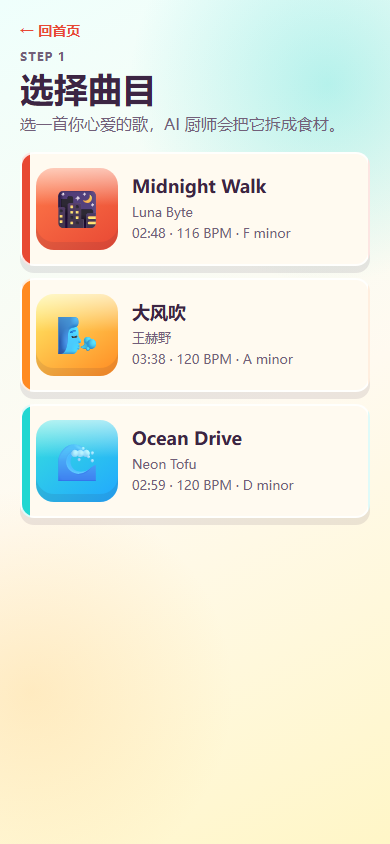
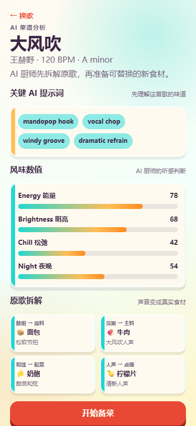
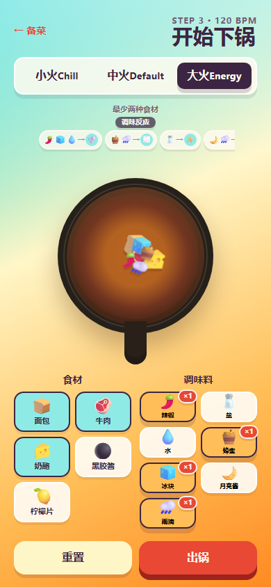

# Remix Kitchen / 音乐私厨

一个移动端 H5 宣传小游戏原型：让 AI 把音乐拆成“食材”，玩家像做菜一样替换、下锅、调味，最后生成一份 remix 菜谱。

在线体验：https://adalek.github.io/remix-kitchen-h5/

## 截图

| 首页 | 选歌 | AI 菜谱分析 | 下锅 remix |
| --- | --- | --- | --- |
|  |  |  |  |

## 项目创意

音乐 remix 的门槛通常像 DAW 一样偏专业。本项目把它转译成更直觉的“私厨”体验：鼓点是底料，贝斯是主料，和弦是配菜，氛围和人声变成调料或点缀。玩家不需要懂音频制作，只需要挑食材、下锅、加调味料，就能理解“AI 帮我分析音乐，并生成可 remix 的素材组合”这个概念。

## 玩法流程

1. 选择一首歌曲，例如《大风吹》。
2. AI 厨师生成歌曲风味和关键提示词。
3. 玩家替换备菜，选择想要的音乐食材。
4. 点击食材下锅，对应 loop 同步播放。
5. 添加调味料改变 Energy、Brightness、Chill、Night 等风味。
6. 出锅后生成 remix 名字、风味数值、使用材料和 AI 厨师评价。

## 实现逻辑

- 前端使用 React + Vite + TypeScript + CSS，无后端。
- 音频使用 Tone.js，所有 loop 由 `Tone.Transport` 统一同步。
- 素材路径集中在 manifest 中，图片或音频缺失时仍可运行。
- 调味料支持重复添加，并通过相生相克规则影响最终风味和音频效果。
- `?shot=landing/select/analysis/cooking` 可直接打开指定展示页，方便生成宣传截图。

## 本地运行

```bash
npm install
npm run dev
```

生产构建：

```bash
npm run build
```
